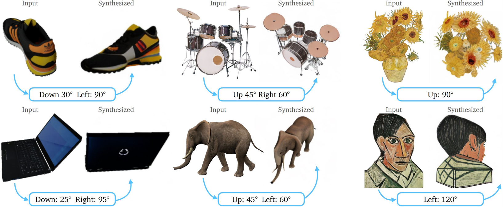

# Zero-1-to-3: Zero-shot One Image to 3D Object
### ICCV 2023
[](https://huggingface.co/spaces/cvlab/zero123-live)
### [Project Page](https://zero123.cs.columbia.edu/)  | [Paper](https://arxiv.org/abs/2303.11328) | [Weights](https://huggingface.co/cvlab/zero123-weights/tree/main) | [Live Demo 🤗](https://huggingface.co/spaces/cvlab/zero123-live)

[Zero-1-to-3: Zero-shot One Image to 3D Object](https://zero123.cs.columbia.edu/)  
 [Ruoshi Liu](https://ruoshiliu.github.io/)<sup>1</sup>, [Rundi Wu](https://www.cs.columbia.edu/~rundi/)<sup>1</sup>, [Basile Van Hoorick](https://basile.be/about-me/)<sup>1</sup>, [Pavel Tokmakov](https://pvtokmakov.github.io/home/)<sup>2</sup>, [Sergey Zakharov](https://zakharos.github.io/)<sup>2</sup>, [Carl Vondrick](https://www.cs.columbia.edu/~vondrick/)<sup>1</sup> <br>
 <sup>1</sup>Columbia University, <sup>2</sup>Toyota Research Institute

### [Novel View Synthesis](https://github.com/cvlab-columbia/zero123#novel-view-synthesis-1):
<p align="center">
  
</p>

### [3D Reconstruction](https://github.com/cvlab-columbia/zero123#3d-reconstruction-sjc):
<p align="center">
  
</p>


## Updates

- [Zero123-XL](https://zero123.cs.columbia.edu/assets/zero123-xl.ckpt) and [Objaverse-XL](https://github.com/allenai/objaverse-xl) released!
- Checkout the [amazing image-to-3D results](https://github.com/threestudio-project/threestudio#zero-1-to-3-) at Threestudio developed by Stability AI!
- [Threestudio](https://github.com/threestudio-project/threestudio#zero-1-to-3-) has recently implemented single-view 3D reconstruction with zero123!  
- [Stable-Dreamfusion](https://github.com/ashawkey/stable-dreamfusion) has recently implemented 3D reconstruction with zero123 using Instant-NGP and SDS loss from DreamFusion!
- We have released [training script](https://github.com/cvlab-columbia/zero123#training-script-preliminary) and [objaverse renderings](https://github.com/cvlab-columbia/zero123#dataset-objaverse-renderings).  
- Live demo released 🤗: https://huggingface.co/spaces/cvlab/zero123-live. Shout out to Huggingface for funding this demo!!  
- We've optimized our code base with some simple tricks and the current demo runs at around 22GB VRAM so it's runnable on a RTX 3090/4090(Ti)!  

##  Usage
###  Novel View Synthesis
```
conda create -n zero123 python=3.9
conda activate zero123
cd zero123
pip install -r requirements.txt
git clone https://github.com/CompVis/taming-transformers.git
pip install -e taming-transformers/
git clone https://github.com/openai/CLIP.git
pip install -e CLIP/
```

Download checkpoint under `zero123` through one of the following sources:

```
https://huggingface.co/cvlab/zero123-weights/tree/main
wget https://cv.cs.columbia.edu/zero123/assets/$iteration.ckpt    # iteration = [105000, 165000, 230000, 300000]
```
Note that we have released 4 model weights: 105000.ckpt, 165000.ckpt, 230000.ckpt, 300000.ckpt. By default, we use 105000.ckpt which is the checkpoint after finetuning 105000 iterations on objaverse. Naturally, checkpoints trained longer tend to overfit to training data and suffer in zero-shot generalization, though we didn't empirically verify this. 300000.ckpt is trained for around 6000 A100 hours.

Run our gradio demo for novel view synthesis:

```
python gradio_new.py
```

Note that this app uses around 22 GB of VRAM, so it may not be possible to run it on any GPU.

### Training Script (preliminary)

Download image-conditioned stable diffusion checkpoint released by [Lambda Labs](https://huggingface.co/spaces/lambdalabs/stable-diffusion-image-variations):  
`wget https://cv.cs.columbia.edu/zero123/assets/sd-image-conditioned-v2.ckpt`

Download and unzip `valid_paths.json.zip` and move the `valid_paths.json` file under the `view_release` folder.

Run training command:  
```
python main.py \
    -t \
    --base configs/sd-objaverse-finetune-c_concat-256.yaml \
    --gpus 0,1,2,3,4,5,6,7 \
    --scale_lr False \
    --num_nodes 1 \
    --seed 42 \
    --check_val_every_n_epoch 10 \
    --finetune_from sd-image-conditioned-v2.ckpt
```

Note that this training script is set for an 8-GPU system, each with 80GB of VRAM. As discussed in the paper, empirically the large batch size is very important for "stably" training stable diffusion. If you have smaller GPUs, consider using smaller batch size and gradient accumulation to obtain a similar effective batch size. Please check [this thread](https://github.com/cvlab-columbia/zero123/issues/22#issuecomment-1493492145) for the train/val split we used in the paper.

### Dataset (Objaverse Renderings)

Download our objaverse renderings with:
```
wget https://tri-ml-public.s3.amazonaws.com/datasets/views_release.tar.gz
```
Disclaimer: note that the renderings are generated with Objaverse. The renderings as a whole are released under the ODC-By 1.0 license. The licenses for the renderings of individual objects are released under the same license creative commons that they are in Objaverse.

### 3D Reconstruction (SDS)
Check out [Stable-Dreamfusion](https://github.com/ashawkey/stable-dreamfusion)

### 3D Reconstruction (SJC)
Note that we haven't extensively tuned the hyperparameters for 3D recosntruction. Feel free to explore and play around!
```
cd 3drec
pip install -r requirements.txt
python run_zero123.py \
    --scene pikachu \
    --index 0 \
    --n_steps 10000 \
    --lr 0.05 \
    --sd.scale 100.0 \
    --emptiness_weight 0 \
    --depth_smooth_weight 10000. \
    --near_view_weight 10000. \
    --train_view True \
    --prefix "experiments/exp_wild" \
    --vox.blend_bg_texture False \
    --nerf_path "data/nerf_wild"
```
- You can see results under: `3drec/experiments/exp_wild/$EXP_NAME`.  


- To export a mesh from the trained Voxel NeRF with marching cube, use the [`export_mesh`](https://github.com/cvlab-columbia/zero123/blob/3736c13fc832c3fc8bf015de833e9da68a397ed9/3drec/voxnerf/vox.py#L71) function. For example, add a line:

    ``` vox.export_mesh($PATH_TO_EXPORT)```

    under the [`evaluate`](https://github.com/cvlab-columbia/zero123/blob/3736c13fc832c3fc8bf015de833e9da68a397ed9/3drec/run_zero123.py#L304) function.  


- The dataset is formatted in the same way as NeRF for the convenience of dataloading. In reality, the recommended input in addition to the input image is an estimate of the elevation angle of the image (e.g. if the image is taken from top, the angle is 0, front is 90, bottom is 180). This is hard-coded now to the extrinsics matrix in `transforms_train.json`

- We tested the installation processes on a system with Ubuntu 20.04 with an NVIDIA GPU with Ampere architecture.

### Discussion on Janus Problem
The design of our method fundamentally alleviates the [Janus problem](https://twitter.com/poolio/status/1578045212236034048?s=20) as shown in the 3D reconstruction results above and many results in the [Stable-Dreamfusion](https://github.com/ashawkey/stable-dreamfusion) repo. By modeling camera perspective in an explicit way and training on a large-scale high-quality synthetic dataset where we can obtain ground truth for everything, the ambiguity and bias of viewpoint existing in text-to-image model is significantly alleviated.

This is also related to the prompting tricks used in DreamFusion where prompts like "a back view of" is inserted at the beginning of the text prompt. Zero-1-to-3 models such change of viewpoint explicitly and finetune on Objaverse to ensure both consistency after viewpoint change and accuracy of queried viewpoint.

##  Acknowledgement
This repository is based on [Stable Diffusion](https://github.com/CompVis/stable-diffusion), [Objaverse](https://objaverse.allenai.org/), and [SJC](https://github.com/pals-ttic/sjc/). We would like to thank the authors of these work for publicly releasing their code. We would like to thank the authors of [NeRDi](https://arxiv.org/abs/2212.03267) and [SJC](https://github.com/pals-ttic/sjc/) for their helpful feedback.

We would like to thank Changxi Zheng and Chengzhi Mao for many helpful discussions. This research is based on work partially supported by the Toyota Research Institute, the DARPA MCS program under Federal Agreement No. N660011924032, and the NSF NRI Award #1925157.


##  Citation
```
@misc{liu2023zero1to3,
      title={Zero-1-to-3: Zero-shot One Image to 3D Object}, 
      author={Ruoshi Liu and Rundi Wu and Basile Van Hoorick and Pavel Tokmakov and Sergey Zakharov and Carl Vondrick},
      year={2023},
      eprint={2303.11328},
      archivePrefix={arXiv},
      primaryClass={cs.CV}
}
```
